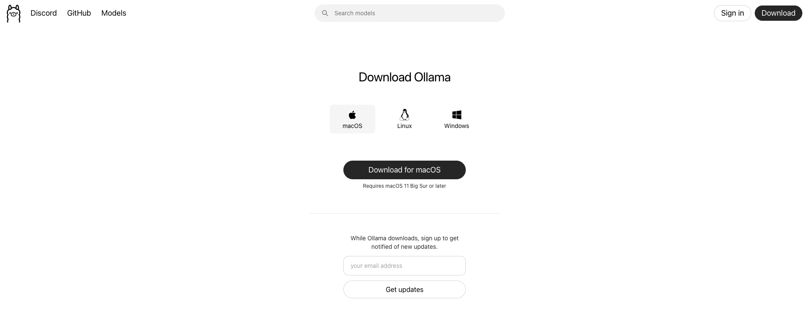
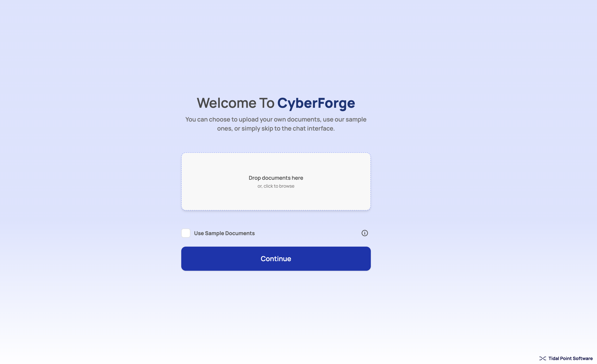
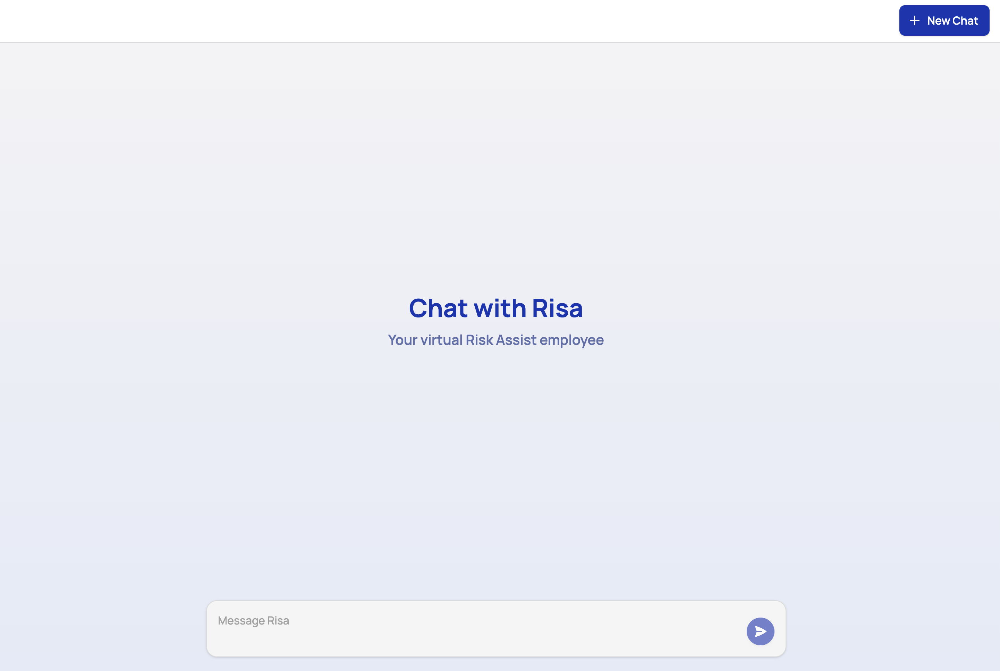
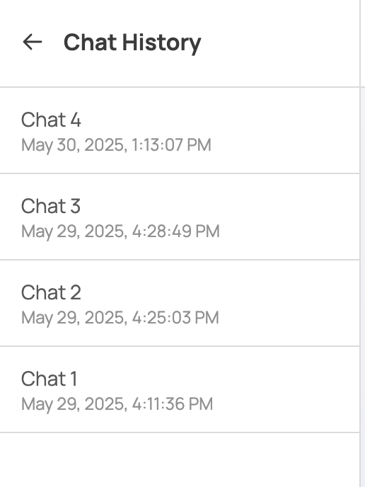
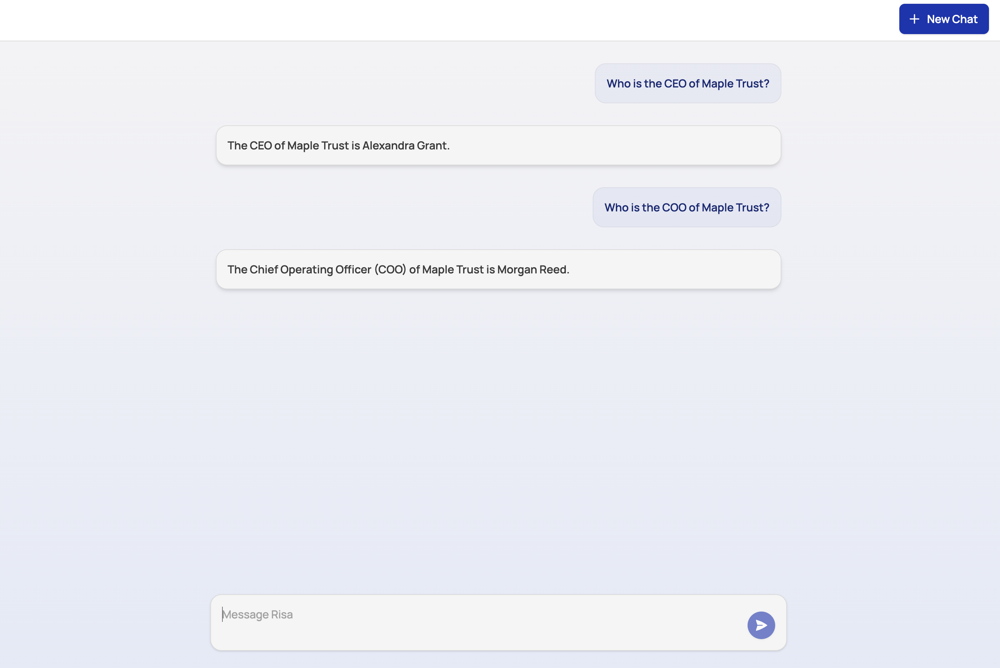
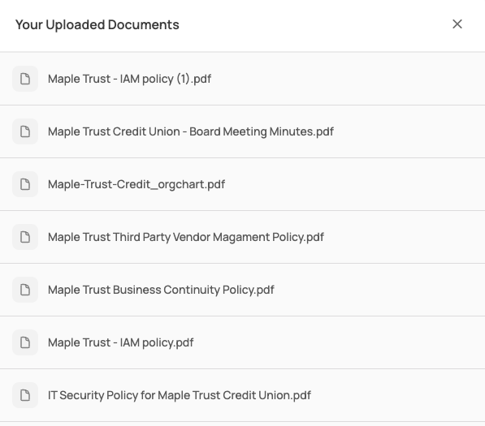

# CyberForge

> Open source cybersecurity assistant powered by LLMs — audit, improve, and secure your organizational policies.

## ✨ Overview

**CyberForge** helps you analyze and improve your company’s policies using large language models (LLMs). Using a self-hosted model in Mistral, CyberForge emables interactions with an AI assistant to obtain detailed insights about your policies. 

## 🚀 Features

- 🔍 Analyze policies in-depth
- 🤖 Context-aware AI agent assistant powered by your own documents
- 🔌 Flexible LLM support (Mistral 7B through Ollama)

## 🔧 Prerequisites

Before you get started, make sure you have the following installed and configured:

| Tool / Requirement                                                       | Description                                           |
| ------------------------------------------------------------------------ | ----------------------------------------------------- |
| [Git](https://git-scm.com/)                                              | Required to clone the repository                      |
| [Node.js](https://nodejs.org/en/download)                                | Required for JavaScript runtime environment           |
| [Python 3.12+](https://www.python.org/downloads/)                        | Required for running the backend                      |
| [Ollama](https://ollama.com/download)                                    | Our LLM model provider                                |
| PDF Policies                                                             | You'll need your policies in `.pdf` format to analyze. If you don’t have any, sample policies are provided directly in the CyberForge application to use.|

> 📃 If you wish to create your own policies for your organization, templates and government guides are provided in the ***guides*** folder.

> ⚠️ Self-hosted models require sufficient system resources (at least 16GB RAM recommended for Mistral 7B).

## 📦 Cloning the Repository

To clone the repository, navigate to a new terminal instance, and run the following commands.

```bash
git clone https://github.com/tidalpoint/cyberforge-ember.git
cd cyberforge-ember
```

## 🛠️ Install Manually

- Download the Ollama app from the link above.



- With the Ollama app running on your machine, navigate to a new terminal instance, and run the following commands:

```bash
ollama pull mistral
ollama pull bge-m3
```

- Now, please ensure you are in the root of the project.

Backend: installs dependencies and starts on [localhost:9009](http://localhost:9009) by default

```bash
cd backend

Windows:
python -m venv .venv
.venv/Scripts/activate

Mac/Linux:
python3 -m venv .venv
source .venv/bin/activate

pip install -r requirements.txt
python app.py
```

- Open a new terminal instance, and ensure you are in the root of the project.

Frontend: installs dependencies and starts on [localhost:5173](http://localhost:5173) by default

```bash
npm install -g yarn

cd frontend

yarn
yarn dev
```

### App Navigation

- Navigate to [localhost:5173](http://localhost:5173) to see CyberForge in action!

## 🛠️ Usage

1. **Upload your policies** (PDF only)
    - Don’t have any policies? You can:
        - Demo with our sample documents from a fictitious Finance company “Maple Trust”. Simply click *Use Sample Documents* on the home page of CyberForge.
        - Use our provided policy templates and government guides, located in the in the ***guides*** folder, to create your own policies for your organization.
2. **Click on the "View Documents" button**
    - This displays all of the documents that are uploaded to this session as context to be used by the LLM. 
2. **Interact with our AI assistant, Orisa 💬**:
    - 🧠 Ask questions about the top threats concerning your policies
    - 📈 Derive insights about your policies
    - 📑 Obtain suggested document improvements
4. **Wish to restart?**
   - Simply navigate back to [localhost:5173/](http://localhost:5173/) or click on the back arrow in the top left corner to restart.
   - Please note that once you restart, the PDFs you've uploaded are reset, and you will have to upload a new set of policies. 
    
> ⚠️ If the frontend or backend process is killed and then started again, the policies are also reset, and you will have to upload a new set of policies.

> 📋 Chat history is preserved across sessions and restarts - allowing you to have a comprehensive overview of your chats at all times. 

## 📷 Screenshots



*Figure 1: Onboarding - Upload Documents*



*Figure 2: Home Page*



*Figure 3: Chat History*



*Figure 4: Chat Interactions*



*Figure 5: Uploaded PDFs*


## 📄 License

MIT ©️ Tidal Point Software
